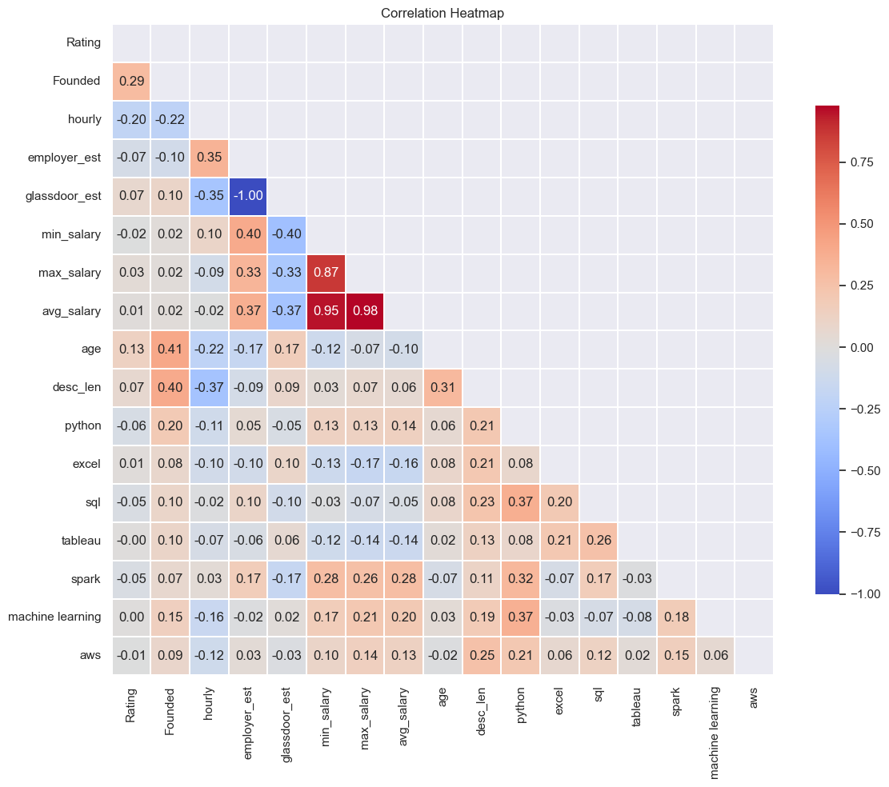
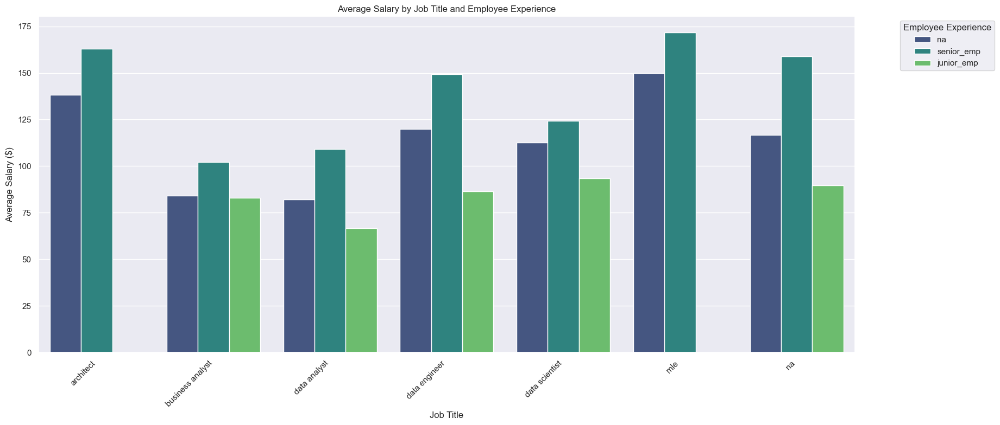
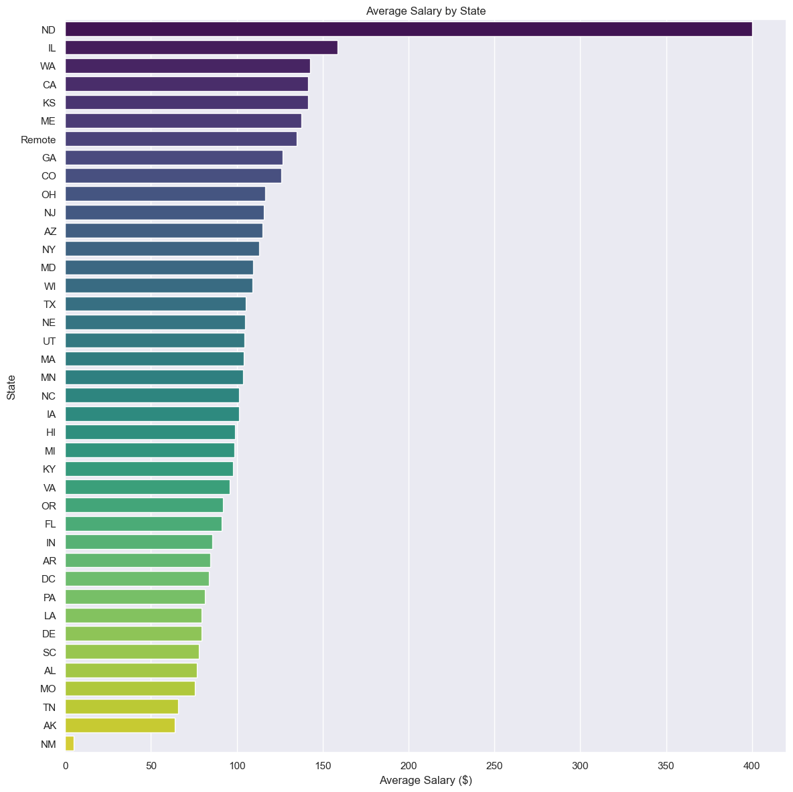

# Data Science Jobs Salary Estimator: Overview

- Created a tool that estimates data science salaries (MAE ~ $ 27.8K) with the info of the job
- Scraped over 1000 job descriptions from glassdoor using python and selenium
- Engineered features from the text of each job description to quantify the value companies put on python, excel, sql, aws, spark, tableau, and machine learning.
- Optimized Linear , Lasso, Ridge Regression, Gradient Boosting, Decision Tree, and Random Forest Regressors using GridsearchCV to reach the best model.
- Built a client facing API using flask

## Code and Resources Used

Python Version: 3.9

Packages: pandas, numpy, sklearn, matplotlib, seaborn, selenium, flask, json, pickle

For Web Framework Requirements: pip install -r requirements.txt

[Project Reference](https://github.com/PlayingNumbers/ds_salary_proj)

[Scraper Github](https://github.com/arapfaik/scraping-glassdoor-selenium)

[EDA](https://www.kaggle.com/code/davidbroberts/data-science-job-posting-on-glassdoor-eda)

[Flask Productionization](https://towardsdatascience.com/productionize-a-machine-learning-model-with-flask-and-heroku-8201260503d2)

## Web Scraping

Scrape 1080 job postings from glassdoor.com. With each job, we got the following:

- Job title
- Salary Estimate
- Job Description
- Rating
- Company
- Location
- Company Size
- Company Founded Date
- Type of Ownership
- Industry
- Sector
- Revenue

## Data Cleaning

After scraping the data, It's time to clean it up so that it was usable for our model. I made the following changes and created the following variables:

- Removed duplicates and rows without salary
- Parsed numeric data out of salary
- Made columns for employer provided salary and hourly wages
- Transformed founded date into age of company
- Replaced -1 to Unknown in certain columns
  - Size
  - Type of ownership
  - Industry
  - Sector
  - Revenue
- Parsed rating out of company text
- Made a new column for company state
- Column for simplified job title and Seniority
- Made columns for if different skills were listed in the job description:
  - Python
  - Excel
  - SQL
  - Tableau
  - AWS
  - Spark
  - Machine Learning
- Column for description length

## EDA

I analyzed the data to uncover salary with differnt variables. Belows are a few highlights.

## Model Building

Transformed the categorical variables into dummy variables, and split the data into train and tests sets with a test size of 20%.

Tried different models and evaluated them using Mean Absolute Error(MAE) and Root Mean Square Error(RMSE)

### Modols Evaluated

- Linear Regression
- Lasso Regression
- Ridge Regression
- Decision Tree
- Random Forest
- Gradient Boosting

## Model Performance

Among all the models, Random Forest model and Gradient Boosting have better performance, and Random Forest is slightly better.

- **Random Forest** MAE: 27.840767 RMSE: 53.933533

- **Gradient Boosting** MAE: 29.769306 RMSE: 56.912239

## Productionization

Built a flask API endpoint that was hosted on a local webserver. The API endpoint takes in a request with a list of values from a job listing and returns an estimated salary.

## Conclusion

Both the Random Forest and Gradient Boosting models demonstrated satisfactory performance in predicting average salaries. The choice between them would depend on specific application needs, computational considerations, and desired interpretability. Further tuning, feature engineering, and the exploration of more complex models might lead to additional performance gains.
