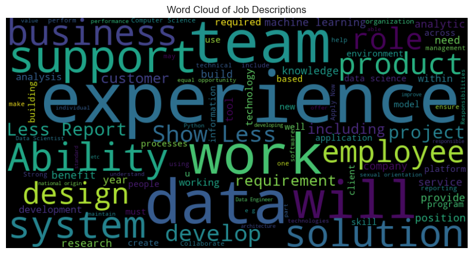

# Data Science Jobs Salary Estimator: Overview

- Created a tool that estimates data science salaries (MAE ~ $ 27.8K) with the info of the job
- Scraped over 1000 job descriptions from glassdoor using python and selenium
- Engineered features from the text of each job description to quantify the value companies put on python, excel, sql, aws, spark, tableau, and machine learning.
- Optimized Linear , Lasso, Ridge Regression, Gradient Boosting, Decision Tree, and Random Forest Regressors using GridsearchCV to reach the best model.
- Built a client facing API using flask

## Code and Resources Used

Python Version: 3.9

Packages: pandas, numpy, sklearn, matplotlib, seaborn, selenium, flask, json, pickle

For Web Framework Requirements: pip install -r requirements.txt

[Project Reference](https://github.com/PlayingNumbers/ds_salary_proj)

[Scraper Github](https://github.com/arapfaik/scraping-glassdoor-selenium)

[EDA](https://www.kaggle.com/code/davidbroberts/data-science-job-posting-on-glassdoor-eda)

[Flask Productionization](https://towardsdatascience.com/productionize-a-machine-learning-model-with-flask-and-heroku-8201260503d2)

## Web Scraping

Scrape 1080 job postings from glassdoor.com. With each job, we got the following:

- Job title
- Salary Estimate
- Job Description
- Rating
- Company
- Location
- Company Size
- Company Founded Date
- Type of Ownership
- Industry
- Sector
- Revenue

## Data Cleaning

After scraping the data, I needed to clean it up so that it was usable for our model. I made the following changes and created the following variables:

- Parsed numeric data out of salary
- Made columns for employer provided salary and hourly wages
- Removed rows without salary
- Parsed rating out of company text
- Made a new column for company state
- Added a column for if the job was at the company’s headquarters
- Transformed founded date into age of company
- Made columns for if different skills were listed in the job description:
  - Python
  - R
  - Excel
  - AWS
  - Spark
- Column for simplified job title and Seniority
- Column for description length

## EDA

## Model Building

## Model Performance

## Productionization

